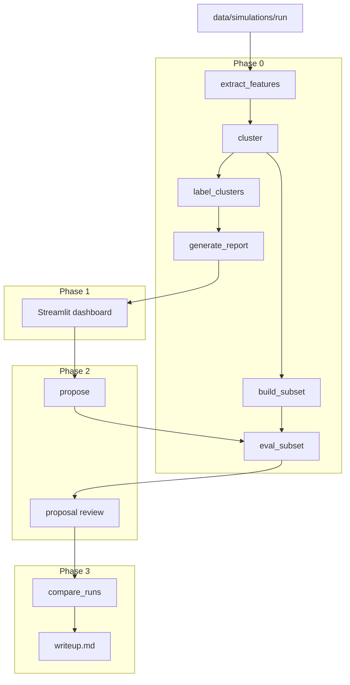

# Harness-Opt Phases

Phased implementation plan for `tools/harness-opt/`. Strategy context: [strategy.md](../strategy.md).

## Phase index

| Phase | Status | Doc | Scope |
|-------|--------|-----|-------|
| **0** | **Implement now** | [phase-0/README.md](phase-0/README.md) | Scripts, contracts, CLI, tests |
| **1** | Docs only | [phase-1/README.md](phase-1/README.md) | Streamlit dashboard MVP |
| **2** | Docs only | [phase-2/README.md](phase-2/README.md) | Proposal pipeline + review |
| **3** | Docs only | [phase-3/README.md](phase-3/README.md) | Generations, stats, writeup |

Contracts (all phases): [contracts/README.md](contracts/README.md)

## Pipeline dependency graph



## Quick start (Phase 0)

```bash
uv sync --extra harness-opt --extra dev

# After a tau2 run (--save-to my-run):
uv run python tools/harness-opt/cli.py analyze --run my-run --baseline my-run

# Build frozen oracle (after baseline):
uv run python tools/harness-opt/cli.py build-subset --run my-run --mode oracle
```

## Baseline handoff

When baseline completes (`baseline-gpt55-t2`, 2 trials):

```bash
uv run python tools/harness-opt/cli.py analyze \
  --run baseline-gpt55-t2 \
  --baseline baseline-gpt55-t2

uv run python tools/harness-opt/cli.py build-subset \
  --run baseline-gpt55-t2 --mode oracle
```

Reports land in `reports/baseline-gpt55-t2/` (gitignored).
