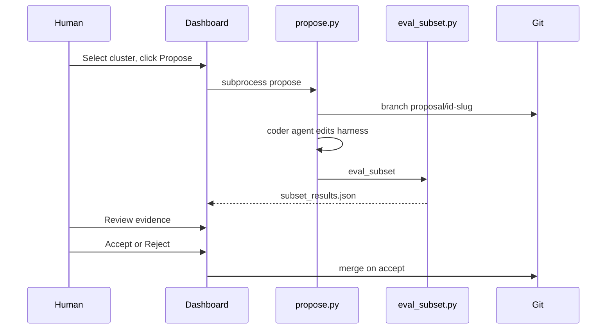

# Phase 2 — Proposal Pipeline

**Status:** Implemented (CLI + artifacts). Dashboard ReviewUI deferred to `dashboard_v2`.  
**Agents:** P2-Propose, P2-EvalHook, P2-ReviewUI (deferred), P2-Git

## Goal

Turn a selected cluster into an auto-coded harness change with an evidence package, gate it on a targeted subset, and land accepted proposals as cumulative squashed commits on a durable lineage branch. One proposal = one failure mode.

## End-product git shape (lineage-per-rollout)

- A pinned **base commit** roots every lineage.
- **`lineage/<id>`** — durable branch per improvement-loop rollout; accepting a proposal advances it by exactly one squashed commit, so proposals stack cumulatively and `git log lineage/<id>` reads as the improvement narrative. Different lineages = different rollouts viewers can compare.
- **`proposal/<id>`** — ephemeral eval branch forked from the current lineage tip; folded into the lineage on accept, deleted on reject.
- **One worktree per lineage** (`.harness-opt-worktrees/<id>`, gitignored) so the current checkout is never touched. A per-lineage lockfile serializes concurrent `propose`.

Code: [tools/harness-opt/lib/lineage.py](../../../tools/harness-opt/lib/lineage.py).

## Coder backends

The actual harness edit is produced by a local coding-agent CLI run headless in the worktree ([tools/harness-opt/lib/coder.py](../../../tools/harness-opt/lib/coder.py)):

| `--coder` | Backend | Notes |
|-----------|---------|-------|
| `auto` (default) | claude → cursor → manual | first available |
| `claude` | Claude Code `claude -p --output-format json` | installed; primary |
| `cursor` | `cursor-agent` CLI or `cursor-sdk` | optional (not installed by default) |
| `manual` | none | prep worktree + evidence, no auto-edit (also used by tests) |

Coder cost uses the local Claude/Cursor subscription — separate from the $50 OpenAI benchmark budget.

## CLI

| Command | Description |
|---------|-------------|
| `harness-opt propose --run NAME --cluster ID [--lineage ID] [--baseline RUN] [--coder auto] [--eval]` | Fork proposal branch from lineage tip, run coder, commit + diff, optional subset gate |
| `harness-opt accept --run NAME --proposal ID` | Squash-commit the proposal onto `lineage/<id>` |
| `harness-opt reject --run NAME --proposal ID` | Delete the ephemeral proposal branch (lineage untouched) |
| `harness-opt list-proposals [--run NAME]` | Print the proposal table + lineage branches |

## Proposal artifact package

```
reports/<run>/proposals/<proposal-id>/
├── metadata.json        # ProposalMetadataArtifact (status, lineage, commits, verdict)
├── proposal.md          # failure mode, coder change summary, eval table, recommendation
├── diff.patch           # proposal branch vs lineage tip
├── coder_log.json       # backend, prompt, raw agent output — "what was proposed / what happened"
├── subset_spec.json
├── subset_results.json  # when --eval
└── proposal_status.json # draft | evaluated | accepted | rejected

reports/<run>/proposals/{index.json, README.md}   # per-run proposal table
reports/lineages/{index.json, README.md, <id>.json}  # repo-level lineage catalog
```

## Eval: subset gate per proposal, full re-baseline per generation

Each proposal is gated by a **subset** run (target + control tasks) compared against the generation baseline run via [eval_subset.py](../../../tools/harness-opt/scripts/eval_subset.py). We do NOT re-run a full baseline per proposal — only at generation boundaries (Phase 3 loop). `--eval` is opt-in (spends OpenAI budget ~$1-3/proposal); without it, `propose` stops at `draft` (branch + diff + evidence) for free.

## Note on worktrees and untracked tooling

Lineage worktrees carry only committed state. Proposals edit `src/tau2/agent/**` (committed), and the candidate `tau2 run` uses committed `src/`, so this is fine — but the `tools/harness-opt/` tooling itself is not present inside a worktree (it runs from the main checkout).

## Workflow



## Agent briefs

### P2-Propose

- **Inputs:** `cluster_labels.json` entry, example task_ids, trace snippets, full codebase
- **Outputs:** `metadata.json`, `proposal.md`, `diff.patch`; triggers eval
- **Rules:** Agent-side harness only; one failure mode
- **Stretch:** `gh pr create` on accept

### P2-EvalHook

- Wraps `eval_subset.py` after proposal branch checkout
- Compares candidate run vs baseline per subset_spec

### P2-ReviewUI (deferred)

- Deferred to the `dashboard_v2` owners. Phase 2 emits the machine-readable feeds (`reports/<run>/proposals/index.json`, `reports/lineages/index.json`) and per-proposal `proposal_status.json` for a dashboard to render. No dashboard code is touched by Phase 2.

### P2-Git

- `lineage/<id>` durable branch (per rollout), `proposal/<id>` ephemeral (per proposal).
- Accept = one squashed commit onto the lineage; proposals stack cumulatively.

## Out of scope (documented)

- Auto-revision loop until subset passes
- Automated accept without human
- Dashboard ReviewUI page (deferred to `dashboard_v2`)

## Acceptance criteria

- `propose` forks a proposal branch from the lineage tip, runs the coder, and writes the full artifact package + indexes (verified end-to-end with `--coder manual`).
- Subset eval runs on `--eval` and gates via `eval_subset` against the generation baseline.
- Accept advances the lineage by exactly one squashed commit; reject deletes the proposal branch and leaves an audit trail. (Covered by `tests/test_proposals.py`.)
