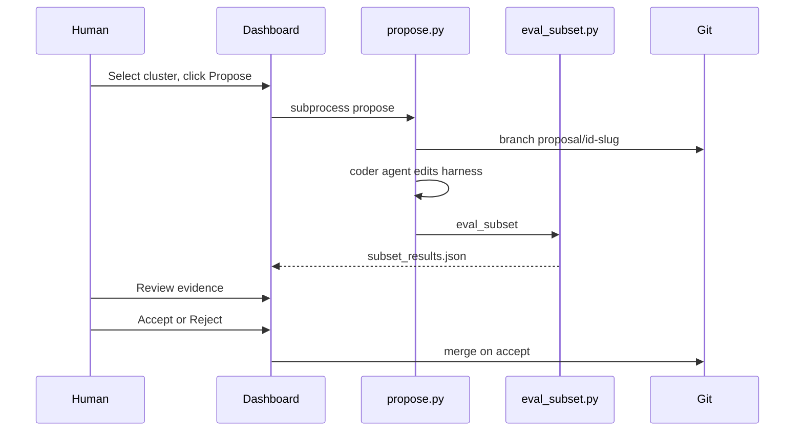

# Phase 2 — Proposal Pipeline

**Status:** Implemented (CLI + artifacts + ReviewUI).  
**Agents:** P2-Propose, P2-EvalHook, P2-ReviewUI, P2-Git

> **ReviewUI is now implemented** as the **Proposals page in the v3 dashboard**
> (`dashboard_v3/`, see [phase-1/dashboard.md](../phase-1/dashboard.md)). It reads
> the machine-readable feeds below (`proposals/index.json`, `lineages/index.json`,
> per-proposal artifacts) and drives `propose`/`accept`/`reject` via the API.
> The note about "deferred to dashboard_v2" is obsolete.

## Goal

Turn a selected cluster into an auto-coded harness change with an evidence package, gate it on a targeted subset, and land accepted proposals as cumulative squashed commits on a durable lineage branch. One proposal = one failure mode.

## End-product git shape (lineage-per-rollout)

- A pinned **base commit** roots every lineage.
- **`lineage/<id>`** — durable branch per improvement-loop rollout; accepting a proposal advances it by exactly one squashed commit, so proposals stack cumulatively and `git log lineage/<id>` reads as the improvement narrative. Different lineages = different rollouts viewers can compare.
- **`proposal/<id>`** — ephemeral eval branch forked from the current lineage tip; folded into the lineage on accept, deleted on reject.
- **One worktree per lineage** (`.harness-opt-worktrees/<id>`, gitignored) so the current checkout is never touched. A per-lineage lockfile serializes concurrent `propose`.

Code: [tools/harness-opt/lib/lineage.py](../../../tools/harness-opt/lib/lineage.py).

## Coder backends

The harness edit is produced by a coder backend run in the worktree ([tools/harness-opt/lib/coder.py](../../../tools/harness-opt/lib/coder.py)):

| `--coder` | Backend | Notes |
|-----------|---------|-------|
| `auto` (default) | openai → claude → cursor → manual | first available |
| `openai` | **Self-contained**: OpenAI key via `llm_utils.generate` → structured edits | **default & reproducible**; cost on the $50 budget, logged |
| `claude` | Claude Code `claude -p` | optional / off-ledger (external subscription) |
| `cursor` | `cursor-agent` CLI or `cursor-sdk` | optional / off-ledger |
| `manual` | none | prep worktree + evidence, no auto-edit (test default) |

**`openai` is the default** because it is the only fully self-contained backend: it runs on the provided API key (per the assignment, the $50 covers "any LLM-powered tooling"), needs no external tools, and is reproducible from just the key. Proposer defaults to a cheap dev model (`gpt-4.1`, override with `--coder-model`); the change it writes is still evaluated under `gpt-5.5`. Report the proposer model as a tooling model-difference. `claude`/`cursor` are opt-in dev conveniences whose cost is off the OpenAI ledger.

Coder cost + model are captured in `coder_log.json`.

## Edit allowlist (precise, northstar-grounded)

The `openai` proposer may edit **only** the handful of agent-behaviour files from the northstar Green Lines ([tools/harness-opt/lib/allowlist.py](../../../tools/harness-opt/lib/allowlist.py)) — this shrinks the search space and hard-enforces the Red lines:

- `src/tau2/agent/llm_agent.py` (★ primary prompt + agent logic)
- a new `*.py` agent module under `src/tau2/agent/` + register in `src/tau2/registry.py`
- `src/tau2/utils/llm_utils.py` (LLM call wrapper)
- `src/tau2/orchestrator/orchestrator.py` (agent-side recovery; fairness-sensitive)

Everything else is rejected, and the Red lines (`data/tau2/domains/**`, `src/tau2/domains/retail/tools.py`, `src/tau2/evaluator/**`, `src/tau2/user/**`) are explicitly denied. Runner/analysis-tooling surfaces are deliberately excluded to keep the proposer focused. The model returns structured `{path, old_string, new_string}` / new-file edits, which we validate against the allowlist and apply atomically (unique-match required) — we never trust the model to patch raw diffs.

## CLI

| Command | Description |
|---------|-------------|
| `harness-opt propose --run NAME --cluster ID [--lineage ID] [--baseline RUN] [--coder auto] [--eval]` | Fork proposal branch from lineage tip, run coder, commit + diff, optional subset gate |
| `harness-opt accept --run NAME --proposal ID` | Squash-commit the proposal onto `lineage/<id>` |
| `harness-opt reject --run NAME --proposal ID` | Delete the ephemeral proposal branch (lineage untouched) |
| `harness-opt list-proposals [--run NAME]` | Print the proposal table + lineage branches |

## Proposal artifact package

```
reports/<run>/proposals/<proposal-id>/
├── metadata.json        # ProposalMetadataArtifact (status, lineage, commits, verdict)
├── proposal.md          # failure mode, coder change summary, eval table, recommendation
├── diff.patch           # proposal branch vs lineage tip
├── coder_log.json       # backend, prompt, raw agent output — "what was proposed / what happened"
├── subset_spec.json
├── subset_results.json  # when --eval
└── proposal_status.json # draft | evaluated | accepted | rejected

reports/<run>/proposals/{index.json, README.md}   # per-run proposal table
reports/lineages/{index.json, README.md, <id>.json}  # repo-level lineage catalog
```

## Proposal context: diverse sampled traces (cost-balanced)

The proposer sees real trajectories, not just per-sim metadata ([tools/harness-opt/lib/trace_render.py](../../../tools/harness-opt/lib/trace_render.py), [tools/harness-opt/lib/sampling.py](../../../tools/harness-opt/lib/sampling.py)):

- **Diversity sampling** picks up to `--num-traces` (default 12) sims from the cluster, maximizing coverage of distinct tasks → tool chains → flag patterns (not N trials of one task).
- **Total char budget** `--trace-char-budget` (default 80,000 ≈ 20k tokens) is split across the sampled traces; per-trace cap is adaptive (`clamp(budget/n, 3000, 12000)`) so small clusters get rich full traces and large clusters get more traces each slightly trimmed.
- **Targeted truncation**: tool-call *arguments* kept in full (the DB-failure signal), tool *results* truncated (~500 chars), failed NL assertions + judge justifications surfaced, transcript middle-elided.

Rationale: a proposal call costs ~$0.06-0.12 vs ~$1 for the eval it gates (~17x). Since the eval is the expensive step, we spend ~10% of it enriching the proposal to raise eval ROI. The budget flags keep it bounded.

## Eval: subset gate per proposal, full re-baseline per generation

Each proposal is gated by a **subset** run (target + control tasks) compared against the generation baseline run via [eval_subset.py](../../../tools/harness-opt/scripts/eval_subset.py). We do NOT re-run a full baseline per proposal — only at generation boundaries (Phase 3 loop). `--eval` is opt-in (spends OpenAI budget ~$1-3/proposal); without it, `propose` stops at `draft` (branch + diff + evidence) for free.

## Note on worktrees and untracked tooling

Lineage worktrees carry only committed state. Proposals edit `src/tau2/agent/**` (committed), and the candidate `tau2 run` uses committed `src/`, so this is fine — but the `tools/harness-opt/` tooling itself is not present inside a worktree (it runs from the main checkout).

## Workflow



## Agent briefs

### P2-Propose

- **Inputs:** `cluster_labels.json` entry, example task_ids, trace snippets, full codebase
- **Outputs:** `metadata.json`, `proposal.md`, `diff.patch`; triggers eval
- **Rules:** Agent-side harness only; one failure mode
- **Stretch:** `gh pr create` on accept

### P2-EvalHook

- Wraps `eval_subset.py` after proposal branch checkout
- Compares candidate run vs baseline per subset_spec

### P2-ReviewUI (implemented in v3 dashboard)

- Implemented as the **Proposals page** in `dashboard_v3/` (see
  [phase-1/dashboard.md](../phase-1/dashboard.md)). Phase 2 emits the
  machine-readable feeds (`reports/<run>/proposals/index.json`,
  `reports/lineages/index.json`, per-proposal artifacts); the dashboard renders
  the lineage catalog, proposals table + detail (coder log / diff / subset eval),
  a new-proposal form, and Accept/Reject — via `/api/.../proposals*` and the
  `propose`/`accept`/`reject` POST actions.

### P2-Git

- `lineage/<id>` durable branch (per rollout), `proposal/<id>` ephemeral (per proposal).
- Accept = one squashed commit onto the lineage; proposals stack cumulatively.

## Out of scope (documented)

- Auto-revision loop until subset passes
- Automated accept without human
- ~~Dashboard ReviewUI page~~ — now implemented (v3 Proposals page)

## Acceptance criteria

- `propose` forks a proposal branch from the lineage tip, runs the coder, and writes the full artifact package + indexes (verified end-to-end with `--coder manual`).
- Subset eval runs on `--eval` and gates via `eval_subset` against the generation baseline.
- Accept advances the lineage by exactly one squashed commit; reject deletes the proposal branch and leaves an audit trail. (Covered by `tests/test_proposals.py`.)
