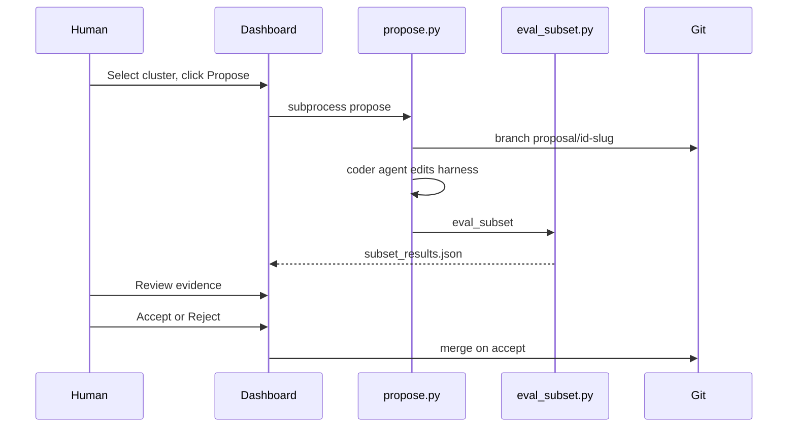

# Phase 2 — Proposal Pipeline

**Status:** Docs only (implement after Phase 1)  
**Agents:** P2-Propose, P2-EvalHook, P2-ReviewUI, P2-Git

## Goal

Turn a selected cluster into an isolated harness change with evidence package. One proposal = one failure mode = one branch/commit.

## CLI (planned)

| Command | Description |
|---------|-------------|
| `harness-opt propose --run NAME --cluster ID` | Create branch, generate diff, subset spec, run eval |
| `harness-opt accept --proposal ID` | Merge branch to main |
| `harness-opt reject --proposal ID` | Mark rejected, delete branch optional |

## Proposal artifact package

```
reports/<run>/proposals/<proposal-id>/
├── metadata.json
├── proposal.md          # LLM summary: failure mode, risk, recommendation
├── diff.patch
├── subset_spec.json
├── subset_results.json
└── proposal_status.json # pending | accepted | rejected
```

## Workflow



## Agent briefs

### P2-Propose

- **Inputs:** `cluster_labels.json` entry, example task_ids, trace snippets, full codebase
- **Outputs:** `metadata.json`, `proposal.md`, `diff.patch`; triggers eval
- **Rules:** Agent-side harness only; one failure mode
- **Stretch:** `gh pr create` on accept

### P2-EvalHook

- Wraps `eval_subset.py` after proposal branch checkout
- Compares candidate run vs baseline per subset_spec

### P2-ReviewUI

- Dashboard page: summary, diff viewer, subset table, accept/reject buttons
- Writes `proposal_status.json`

### P2-Git

- `proposal/<id>-<slug>` branch naming
- One commit per proposal; merge creates single commit on main

## Out of scope (documented)

- Auto-revision loop until subset passes
- Automated accept without human

## Acceptance criteria

- Propose from dashboard creates branch + full artifact package
- Subset eval runs automatically
- Accept merges with one commit; reject leaves audit trail
