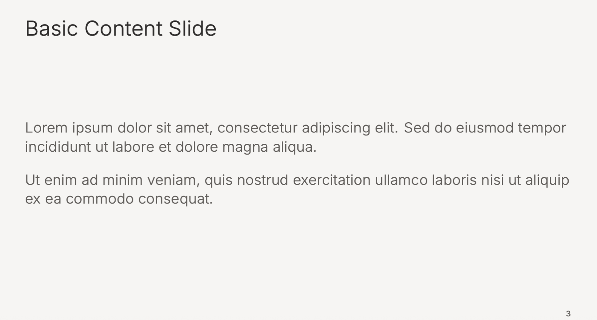
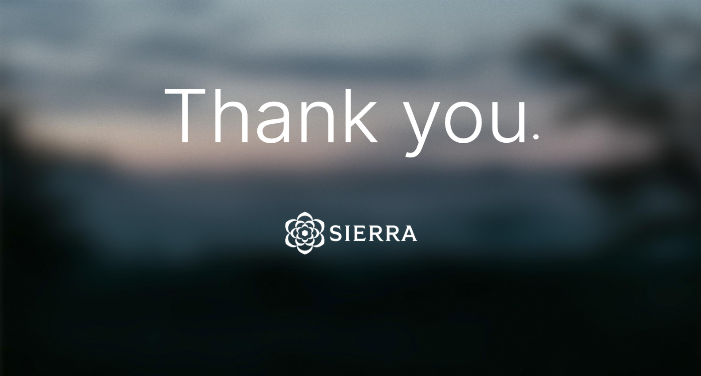

# (Unofficial!) Sierra Beamer Template 🌲

> 💀 *Do you die a little inside every time you use Google Slides?*
> 
> 😍 *Do you simply* ***love*** *the inherent beauty of LaTeX?*
> 
> 🙏 *Have you always dreamt of having an AI assistant that would just... make your slides for you?*
> 
> 😰 *Do you want to use LaTeX but you're scared of Wayne?* 

### Well, your prayers have been answered. *(Sort of.)*

This is a LaTeX Beamer presentation theme for Sierra AI. Create beautiful, brand-consistent slides by asking Cursor nicely. Is it overkill? Absolutely. Is it elegant? We think so. Will your colleagues question your life choices? Almost certainly.

> **Features:** Dark forest title slides • Clean beige content slides • Green statement slides • Quote slides • Section dividers • Thank you slides — all with Sierra's brand colors and Inter font family.

<p align="center">
  
  
  
  
</p>

---

## 🚀 Quick Start (5 minutes)

### Step 1: Clone the Template

```bash
git clone https://github.com/sierra-research/sierra_beamer_template.git
cd sierra-beamer-template
```

### Step 2: Install Dependencies

Run the install script to set up LaTeX (works on macOS and Linux):

```bash
./install.sh
```

This installs:
- LaTeX (BasicTeX on macOS, TeX Live on Linux)
- All required packages (beamer, fontspec, etc.)

> ⏱️ First-time installation takes 5-10 minutes. Grab a coffee!

### Step 3: Create Your Presentation

```bash
./new-project.sh my-awesome-presentation
```

This creates a new folder with everything you need:
- Pre-configured `.tex` file ready to edit
- All Sierra theme files
- Fonts and assets
- Makefile for easy building

### Step 4: Open in Cursor and Start Creating!

```bash
cursor my-awesome-presentation
```

**That's it!** Open the `.tex` file and start creating slides. The AI in Cursor understands the Sierra template and can help you create professional slides.

---

## 🤖 Creating Slides with Cursor AI

The template includes Cursor rules that help the AI understand Sierra's format. Just ask naturally:

| You say... | AI creates... |
|------------|---------------|
| "Add a slide about our Q4 results" | Content slide with bullet points |
| "Create a comparison between A and B" | Two-column layout slide |
| "Add an impactful statement" | Green statement slide |
| "Insert a quote from Steve Jobs" | Styled quote slide |
| "Add a section divider for 'Strategy'" | Gradient background section slide |
| "Create a data table with 3 columns" | Professionally styled table |

### Example Prompts

```
Add a slide titled "Key Metrics" with 4 bullet points about:
- Revenue growth
- Customer satisfaction
- Market expansion
- Team growth
```

```
Create a quote slide with:
"The best way to predict the future is to invent it."
- Alan Kay, Computer Scientist
```

```
Add a two-column comparison slide:
Left: Benefits of AI
Right: Challenges to Address
```

---

## 📁 Project Structure

After running `./new-project.sh`, your project looks like:

```
my-presentation/
├── my-presentation.tex    ← Edit this file!
├── Makefile               ← Build commands
├── assets/                ← Backgrounds & logos
│   ├── sierra-forest-bg.png
│   ├── sierra-gradient-bg.png
│   ├── sierra-dusk-bg.jpg
│   └── sierra-logo-white.png
├── fonts/                 ← Inter font family
└── *.sty                  ← Theme files (don't edit)
```

---

## 🔨 Building Your Presentation

### Build to PDF

```bash
cd my-presentation
make build
```

### Open the PDF

```bash
make open
```

### Clean auxiliary files

```bash
make clean
```

### Direct compilation

```bash
xelatex my-presentation.tex
```

---

## 🎨 Slide Types

### Title Slide
Dark forest background with white text. Created automatically when you use `\titlepage`.

### Content Slides
Warm beige background with clean typography. The default for most slides.

### Section Dividers
Green gradient background. Use to separate major sections.

### Statement Slides
Large centered text for key messages. Available in light (beige) and green variants.

### Quote Slides
Styled quotations with attribution. Great for testimonials.

### Thank You Slide
Dusk background with Sierra logo **always centered at the bottom**. Perfect ending.

> **Important:** The Sierra logo must always be centered at the bottom of the thank you slide. Use TikZ absolute positioning (not `\vfill`) to ensure consistent placement regardless of content length.

---

## 🎨 Theme Options

```latex
% Default (light theme, dark title page)
\usetheme{Sierra}

% Dark mode (all slides dark)
\usetheme[dark]{Sierra}

% Minimal (no footer/page numbers)
\usetheme[minimal]{Sierra}

% Light title page (no forest background)
\usetheme[notitlebackground]{Sierra}

% Combined options
\usetheme[dark,minimal]{Sierra}
```

---

## 🎨 Brand Colors

All Sierra brand colors are available:

```latex
\textcolor{SierraGreen}{Green text}
\textcolor{SierraOrange}{Orange highlight}
\textcolor{SierraCharcoal}{Dark text}
```

| Color | Hex | Usage |
|-------|-----|-------|
| `SierraDarkGreen` | #05351D | Dark backgrounds |
| `SierraGreen` | #006838 | Primary brand color |
| `SierraCharcoal` | #302E2D | Titles, headings |
| `SierraTaupe` | #625E5B | Body text |
| `SierraOrange` | #F96205 | Alerts, highlights |
| `SierraBlue` | #8BBFF5 | Secondary accent |
| `SierraBone` | #F6F5F3 | Light background |

---

## 📝 Common Slide Patterns

### Basic Content
```latex
\begin{frame}{Your Title}
  Content goes here.
  
  \begin{itemize}
    \item First point
    \item Second point
  \end{itemize}
\end{frame}
```

### Two Columns
```latex
\begin{frame}{Comparison}
  \begin{columns}[T]
    \begin{column}{0.48\textwidth}
      \textbf{Option A}
      \begin{itemize}
        \item Pro 1
        \item Pro 2
      \end{itemize}
    \end{column}
    \begin{column}{0.48\textwidth}
      \textbf{Option B}
      \begin{itemize}
        \item Pro 1
        \item Pro 2
      \end{itemize}
    \end{column}
  \end{columns}
\end{frame}
```

### Statement Slide
```latex
{
\setbeamercolor{background canvas}{bg=SierraGreen}
\begin{frame}[plain]
  \centering\vfill
  {\fontsize{24}{30}\selectfont\interlight\textcolor{SierraWhite}{%
    Your powerful statement here.%
  }}
  \vfill
\end{frame}
}
```

### Thank You Slide (with centered logo at bottom)

**IMPORTANT:** The Sierra logo must ALWAYS be centered at the bottom of the thank you slide. Use TikZ absolute positioning to guarantee consistent placement.

```latex
{
\usebackgroundtemplate{%
  \includegraphics[width=\paperwidth,height=\paperheight]{assets/sierra-dusk-bg.jpg}%
}
\begin{frame}[plain]
  \centering
  \vfill
  
  % Thank you message - centered vertically
  {\fontsize{48}{58}\selectfont\interlight\textcolor{SierraWhite}{Thank you{\large\textbullet}}}
  
  \vfill
  
  % Logo MUST be centered at bottom - use TikZ for absolute positioning
  \begin{tikzpicture}[remember picture,overlay]
    \node[anchor=south, inner sep=0] at ([yshift=0.08\paperheight]current page.south) {%
      \includegraphics[height=1.5cm]{assets/sierra-logo-white.png}%
    };
  \end{tikzpicture}
\end{frame}
}
```

> **Why TikZ?** Using `\vfill` alone doesn't guarantee the logo stays at the bottom—it distributes space evenly. TikZ `[remember picture,overlay]` positions the logo absolutely at a fixed offset from the page bottom, ensuring consistent placement regardless of the thank you message length.

---

## 🔧 Troubleshooting

### "xelatex: command not found"

The PATH wasn't updated. Try:
```bash
# macOS
export PATH="/Library/TeX/texbin:$PATH"

# Or restart your terminal
```

### Fonts not loading

Make sure you're using XeLaTeX (not pdflatex):
```bash
xelatex presentation.tex  # ✓ Correct
pdflatex presentation.tex # ✗ Won't work
```

### Missing packages

Install any missing LaTeX packages:
```bash
sudo tlmgr install <package-name>
```

---

## 📚 Advanced Usage

### Adding Images

```latex
\begin{frame}{With Image}
  \centering
  \includegraphics[width=0.6\textwidth]{path/to/image.png}
\end{frame}
```

### Code Blocks

```latex
\begin{frame}[fragile]{Code Example}
  \begin{verbatim}
  def hello():
      print("Hello, Sierra!")
  \end{verbatim}
\end{frame}
```

### Math Equations

```latex
\begin{frame}{Mathematics}
  The quadratic formula:
  \[ x = \frac{-b \pm \sqrt{b^2 - 4ac}}{2a} \]
\end{frame}
```

---

## 🗂️ Example Presentation

View the full example showcasing all slide types:

```bash
make example
open examples/example-presentation.pdf
```

---

## 📄 License

This template is provided for Sierra AI internal and external presentations.

Inter font by Rasmus Andersson (SIL Open Font License).

---

## 🆘 Need Help?

- **Cursor AI**: Just ask! The AI understands this template.
- **LaTeX basics**: [Overleaf LaTeX tutorials](https://www.overleaf.com/learn)
- **Beamer docs**: [Beamer User Guide](https://ctan.org/pkg/beamer)
