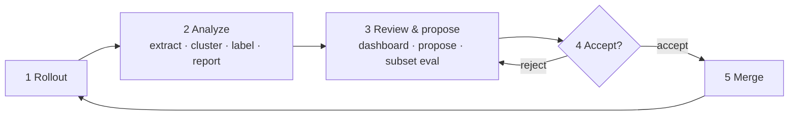

# τ2-bench Retail Harness Optimization


My goal for this project was build a coding agent that makes **targeted changes** (i.e. changes that directly address 
a failure-mode) to the harness that are **generally good** (i.e. improve the failure-mode cases, do not regress 
non-failure-mode cases, and are not hyper specific to one potentially noisy failing trace).
The bet I took in this project was that a good layer of abstraction between raw traces and the coding agent, in 
conjunction with a well designed lift/regression test to judge harness changes, would enable the agent to make 
targeted yet generally good changes to the harness, and improve overall performance on the full task set. I ended
up building exactly this with a clustering engine that analyzes and groups traces by failure mode, a coding agent
which proposes harness changes that target each of these failure modes, and a judging procedure that gates harness 
change proposals based on performance on a subset of tasks. After running 1.5 generations of the improvement loop on
the base harness in tau-bench, the tuned agent (`retail_llm_agent`) measured on the  full `gpt-5.5` benchmark 
(114 tasks × 2 trials, `data/simulations/cand-gpt55-full-t2`) lifts pass² from 76.3% to 89.5% over the baseline.

Everything in this writeup (the baseline and tuned rollouts, the A/B comparison,
and the full per-generation optimization loop) is runnable from
[`runbook.md`](runbook.md).

## 1. Baseline results and main failure modes

Baseline is the stock `llm_agent`, `gpt-5.5` agent and user, 2 trials × 114 tasks =
228 simulations (`data/simulations/baseline-gpt55-t2`).


| Metric                   | Value                 |
| ------------------------ | --------------------- |
| Sim-level pass           | **192 / 228 = 84.2%** |
| pass² (both trials pass) | 87 / 114 = 76.3%      |
| pass@1 (≥1 trial passes) | 105 / 114 = 92.1%     |


The 36 failing sims break down into 31 DB-state mismatches and 5 NL-assertion
misses. Every sim ended in a `user_stop` command so there was no indication of premature terminations, max-error
exits, or JSON/tool errors. Using the clustering engine and visualization dashboard I built to guide my search, I saw that 
failures fell into five main buckets...

| #      | Mechanism                                | Failing sims | Evidence                                                                                                                                                                                                                                                               |
| ------ | ---------------------------------------- | ------------ | ---------------------------------------------------------------------------------------------------------------------------------------------------------------------------------------------------------------------------------------------------------------------- |
| **C1** | **Premature `transfer_to_human_agents`** | **15 / 36**  | Agent transfers at first friction and abandons remaining in-scope work; 12 did zero writes. task 32 transfers on an out-of-scope refund and skips four in-scope cancels/returns. task 68 has all order totals but transfers instead of answering "how much did I pay?" |
| C2     | Cancellation-reason mismatch             | 5            | Agent offers `no longer needed` / `ordered by mistake` as a menu; the DB-hashed reason ends up wrong (tasks 38, 66, 88).                                                                                                                                               |
| C3     | Variant / `new_item_id` resolution       | 5            | Agent copies the original item's unspecified options instead of surfacing matching variants (task 60 picks the wrong `new_item_id`).                                                                                                                                   |
| C4     | Incomplete multi-step / implied action   | 6            | Agent stops after partial completion or answers an info question without doing the implied write (task 108 answers "how much back?" but never runs the return).                                                                                                        |
| C5     | NL-assertion misses                      | 5            | DB is usually correct; the LLM judge flags a missing required statement. Overlaps C1. Deprioritized.                                                                                                                                                                   |


C1 is clearly the failure mode with the highest leverage. Premature transfers alone were ~40% of failing sims.

---

## 2. What I built and changed, and why

I built a per-generation optimization loop in `tools/harness-opt/`. This process could run autonomously, 
though I chose to add human gates at two steps (starting a rollout and accepting/rejecting a proposal). 

### The loop



Human-gated steps: **1 Rollout**, the review inside **3**, and **4 Accept/reject**.
One generation is one trip around the loop; accepted proposals stack as squashed
commits on a `lineage/<id>` branch.

#### 1. Rollout — `tau2 run`

Runs the benchmark and writes an immutable `data/simulations/<run>/results.json`.
Full 114-task × 2-trial runs at generation boundaries; cheap subset runs during
iteration. This is the only step that spends eval budget, so a human triggers it.

#### 2. Analyze — `extract_features.py` → `cluster.py` → `label_clusters.py` → `generate_report.py`

One automatic pass (`cli.py analyze`) that reads traces only (no harness code, no
`tasks.json`) to avoid hindsight bias:

- **Extract** (`lib/trace_parser.py`, `lib/db_diff.py`): each trajectory turns into a
  structured record (tool-call chain, policy flags, error counts, termination reason,
  denoised NL-assertion signatures)
- **Cluster** (`lib/embedding_cluster.py`, `lib/minilm_numpy.py`): embed each failing
  trace and run agglomerative cosine clustering with an auto-selected distance
  threshold (loosest threshold whose largest cluster stays ≤ 45%, which stopped the
  weak-model run collapsing into one blob). The text-to-embed is an enriched "fingerprint"
  of the trace. A few of the best performing features in this enriched text were a normalized
  tool-call chain, the agent's final message, the trace structure with noisy details redacted
  (product information, names, cities, etc.), and a diff between the desired
  and realized database state. These features enriched the trace's embedding beyond
  just dumping the full trace, and in an ablation against all other clustering strategies,
  proved to achieve the highest clustering performance as measured by silhouette score on a 
  hand-labeled data set of failures. The embedder is all-MiniLM-L6-v2 via a
  pure-NumPy forward pass (no torch, no network, no budget); an ablation vs
  hand-labeled root causes chose it (ARI 0.70 vs tf-idf 0.47, signature 0.20). The
  primary axis is a deterministic root-cause mechanism (`bailed_transfer`,
  `wrong_params`, `stalled_no_action`, …) that matched hand labels 91% (33/36) which 
  were created manually to evaluate clustering behavior.
- **Label** (`gpt-4.1-mini`): a name, cohesion score, and blame tags from 2–3
  representatives per cluster. Representatives only, so cost is negligible.
- **Report**: persists `task_summary.csv`, `analysis_summary.md`, `manifest.json`

#### 3. Review & propose — `dashboard_v3/` → `propose.py` → `eval_proposal.py`

- **Dashboard review** (`dashboard_v3/`): a human reads
  the report artifacts and picks which cluster is worth a fix (walkthrough below).
- **Propose** (`lib/coder.py`, `lib/allowlist.py`, `lib/lineage.py`): forks a
  `proposal/<id>` branch off the current lineage tip in an isolated worktree and runs
  a self-contained OpenAI coder that emits validated
  `{path, old_string, new_string}` edits; an allowlist permits agent-side files only
  and hard-denies every red-line path.
- **Subset eval** (`build_subset.py`): gates the proposal based on a small subset eval. A
  frozen global oracle (stable passes must not regress) plus the cluster's failing tasks
  (must net-improve). About 10× cheaper than a full run. This can't be taken as proof
  that it will lift the whole eval, but it is a very good proxy signal.

#### 4. Accept / reject — `scripts/manage_proposal.py`

The reviewer accepts or rejects in the dashboard. Subset noise is too high to
auto-merge, so a human decides. If they reject, the process loops back to step 3.

#### 5. Merge — `lib/lineage.py`

Accept advances the lineage by one squashed commit. The next generation runs from the
new tip.

### Dashboard walkthrough

The dashboard is the human surface for steps 3 and 4 and allows for frictionless trace 
analysis so that the improvement process is transparent. It turns the `reports/<run>/`
artifacts into a "what failed → propose → review → accept" workflow in the browser.

**Overview** — headline metrics and the root-cause mechanism breakdown
(`baseline-gpt55-t2`: 84.2% pass, 36 failures, `bailed_transfer` = 13).


*Dashboard overview: 228 sims, 84.2% pass, root-cause mechanism bars, top failure clusters*

**Clusters** — drill into a mode. `c_000` shows its mechanism composition (13
`bailed_transfer` + 2 `identification_failure`) and every member's tool chain; the
`… → transfer_to_human_agents` tails make the premature-transfer pattern obvious. This
is the page that made it super easy to figure out the failure modes, and group failing traces
for easier analysis.


*Clusters page: c_000 detail with mechanism composition and per-trace tool chains*

**Embedding** — the geometry behind the clustering in step 2: a centroid map (bubble = cluster, size =
#sims), a per-sim scatter, and a centroid-cosine heatmap for spotting mergeable
clusters.


*Embedding page: centroid map, sim scatter, and cluster-similarity heatmap*

**Traces** — a swimlane timeline of two trajectories side by side (per-turn latency
and cost) and a message-level diff. This page makes it really easy to compare traces
once they are clustered and gain an intuition for what is failing while the agent
implements the change on its own.

| | |
| --- | --- |
|  |  |
|Traces: side-by-side trajectory swimlanes |Traces: message-level side-by-side diff of two trajectories|

**Proposals** — pick a cluster, auto-code an isolated edit on a lineage worktree, then
review: the coder summary and diff, an editable side-by-side diff (only allowlisted
files are writable), and Accept / Reject / Run-eval controls.


| | | |
| --- | --- | --- |
|  |  |  |
|Proposals page: new-proposal form, lineage, and proposal list |Proposal detail: coder summary, diff, and accept/reject controls |Proposal edit-diff: editable side-by-side diff restricted to allowlisted files|

### Harness change — `retail_llm_agent` (proposals P1–P7)

The loop produced seven proposals against the baseline clusters. Five passed subset
eval (positive lift, no control regressions) and merged into
`src/tau2/agent/retail_llm_agent.py`, a thin `LLMAgent` subclass that swaps only the
operating-rules prompt so `llm_agent` stays byte-identical for a clean A/B. Two
failed subset eval and were rejected.


| Proposal                               | Target cluster                                 | Subset lift          | Control regressions | Verdict      |
| -------------------------------------- | ---------------------------------------------- | -------------------- | ------------------- | ------------ |
| **P1** Transfer discipline             | C1 premature transfer                          | +6/8 tasks           | 0/4                 | **Accepted** |
| **P2** Cancellation reason, not a menu | C2 reason mismatch                             | +2/3 tasks           | 0/4                 | **Accepted** |
| **P3** Surface variant choices         | C3 variant resolution                          | +2/4 tasks           | 0/4                 | **Accepted** |
| **P4** Drive implied actions           | C4 incomplete multi-step                       | +3/5 tasks           | 0/4                 | **Accepted** |
| **P5** Proactive lookup                | `stalled_no_action` / `identification_failure` | +4/6 tasks           | 0/4                 | **Accepted** |
| **P6** JSON / argument-repair retries  |  ---                                           | 0 (no such failures) | 0/4                 | **Rejected** |
| **P7** Auth-flow reminders             |  ---                                           | 0/2 tasks            | 1/4                 | **Rejected** |


*Per-proposal subset figures attribute the combined `gpt-5.5` subset run to each
cluster (1-trial screening); the aggregate is the +26-sim result in §3.*

<details>
  <summary>Accepted diffs (P1–P5) — merged into `retail_llm_agent.py`</summary>
  
**P1 — Transfer discipline** (C1)

```diff
+## Finish the whole request
+- Transfer to a human agent ONLY when the entire remaining request is outside your
+  tools and policy. If only part is out of scope, clearly decline that part and
+  continue with everything you can do. Never transfer while any in-scope action
+  remains.
+- When a tool or policy limitation blocks the user's preferred option, explain it
+  and offer the alternatives you can perform, then let the user choose.
```

**P2 — Cancellation reason** (C2)

```diff
+## Cancellation reason
+- When cancelling a pending order, do not present "no longer needed" and "ordered by
+  mistake" as a menu. Ask why in the user's own words, then map to the closest
+  allowed reason. Confirm the single mapped reason before cancelling.
```

**P3 — Surface variant choices** (C3)

```diff
+## Choosing item variants
+- When more than one available variant matches everything the user asked for, list
+  those variants (showing the differing options and prices) and ask which one before
+  writing. Do not fill unspecified options by copying the original item's values.
```

**P4 — Drive implied actions** (C4)

```diff
+## Drive implied actions
+- If the user's reason for contacting you implies an action (return, cancel, modify,
+  exchange) but they only ask an informational question, answer it and then offer to
+  carry out the action, confirming before any change. Do not passively wait.
```

**P5 — Proactive lookup** (`stalled_no_action` / `identification_failure`)

```diff
+## Look things up yourself
+- Never ask the user for an order ID or item ID. After authenticating, call
+  get_user_details then get_order_details to find them yourself. Only ask for
+  information you genuinely cannot obtain from the tools.
```
</details>


<details>
  <summary>Rejected diffs (P6–P7) — proposed, then reverted</summary>

**P6 — JSON / argument-repair retries** (rejected). Proposed a retry-and-repair
wrapper in `utils/llm_utils.py`; reverted. Zero JSON or tool errors occurred in any
baseline sim, so there was nothing to fix and subset lift was zero.

```diff
# utils/llm_utils.py (proposed, reverted)
+    for attempt in range(MAX_JSON_RETRIES):
+        try:
+            return json.loads(raw)
+        except json.JSONDecodeError:
+            raw = repair_json(raw)
```

**P7 — Auth-flow reminders** (rejected). Proposed a re-verify-identity reminder;
reverted. The baseline already authenticates correctly, so the reminder added no
lift and re-asking an already-authenticated user broke one control task.

```diff
# AGENT_INSTRUCTION (proposed, reverted)
+- Always re-verify the user's identity (email, or name plus ZIP) before every
+  account action, even later in the conversation.
```
</details>


While P6 and P7 seem like potentially good harness changes, the extract step showed no JSON errors 
and no auth failures across 228 sims, and subset eval confirmed neutral or negative results 
before a full run. Since we can't confidently classify P6 and P7 as strictly better, we reject
the changes.

---

## 3. Final results vs baseline, and confidence

### Full `gpt-5.5` benchmark (measured)

`retail_llm_agent` vs the baseline on the full retail suite (114 tasks × 2 trials,
same `gpt-5.5` agent and user, `cand-gpt55-full-t2` vs `baseline-gpt55-t2`).


| Metric                      | Baseline `llm_agent` | `retail_llm_agent`    | Δ             |
| --------------------------- | -------------------- | --------------------- | ------------- |
| pass² (both trials)         | 87 / 114 = 76.3%     | **102 / 114 = 89.5%** | **+15 tasks** |
| Sim-level pass (avg reward) | 192 / 228 = 84.2%    | **213 / 228 = 93.4%** | +23 sims      |
| pass@1 (≥1 trial)           | 105 / 114 = 92.1%    | 111 / 114 = 97.3%     | +6 tasks      |


At the pass² level, 19 tasks flipped from failing to passing and 4 flipped from passing
to failing (net +15). To attribute a confidence to these results I used McNemar's test for paired categorical data on the flips (19 vs 4). 
This gives a p-value of **p ≈ 0.003**, so at a significance level of **α ≈ 0.05** the gain is well beyond 
the trial-to-trial noise floor. The dashboard's Compare-runs page shows the same numbers, the task-outcome flow, and
the per-mode shift for any two runs. This is how a harness variant is easily judged against
its baseline.


*Compare-runs page: candidate vs baseline headline, task-outcome flow, failure-mode shift, and the four regressions*

**The 4 regressions** (tasks 10, 42, 93, 98) show the cost of adding operating rules and 
are the reason why we err on the side of caution when accepting a change.
Of the four regressions, two failed as `bailed_transfer` (10, 42) and two as `wrong_params` (93, 98).
Despite the regressions, the net effect is strongly positive.

---

## 4. Cost breakdown

Figures are approximate, from tau2 run metadata (`agent_cost + user_cost`), rounded to
the nearest dollar.


| Item                                               | Model          | Cost     |
| -------------------------------------------------- | -------------- | -------- |
| `baseline-gpt55-t2` (baseline)                     | `gpt-5.5`      | ~$33     |
| `cand-gpt55-full-t2` (final candidate)             | `gpt-5.5`      | ~$36     |
| `cand-gpt55-failsubset-t2` (27-task subset screen) | `gpt-5.5`      | ~$10     |
| `baseline-gpt54mini-t2`                            | `gpt-5.4-mini` | ~$4      |
| `ccand-gpt54mini-t2`                               | `gpt-5.4-mini` | ~$4      |
| `ccand-gpt54mini-t2-r2`                            | `gpt-5.4-mini` | ~$4      |
| Proposal coder                                     | `gpt-4.1`      | ~$2      |
| Cluster labeling + ablation                        | `gpt-4.1-mini` | ~$1      |
| **Total**                                          |                | **~$94** |


---

## 5. What did not work

My first clustering approach was a decision tree over trace signatures. It was mostly hand-written
rules that read the DB-diff and the tool chain and sorted each failure into a bucket.
It was easy to read, but it was super brittle. Small differences in a trace could send nearly
identical failures down different branches. The baseline came out as about 20
clusters with more than half of them singletons which not a particularly useful result to guide the
coding agent's changes. I quickly switched to the embedding enriched traces approach with "agglomerative clustering",
which groups by overall similarity instead of a fixed branch order, and the singleton problem
mostly went away. One small problem arose from this. First, a single fixed
distance threshold did not work between different runs: on the weak model it dumped about 74%
of failures into one giant cluster, so I now pick the threshold per run by clustering
as aggressively as possible without having the largest cluster contain over 45% of traces.

The coding agent had two separate problems. The first was git plumbing. My original
design gave every proposal its own worktree. With several proposals per generation
that cluttered up the disk and left orphaned worktrees behind whenever a run died
halfway through. It was honestly super annoying to work with. I moved to one worktree per lineage, 
with each accepted proposal as a single squashed commit, which keeps the disk usage flat.
The second problem is the coder itself. It only makes one small edit at a time, and
it is pretty unreliable: some runs returned a clean single-block diff for a few cents, and
one run died on a transient API error and handed back an empty patch. It is fine for
drafting a narrow change, but it took some babysitting to get to the five-rule changes we implemented.

---

## 6. AI assistance

- **Cursor** helped build the `tools/harness-opt/` pipeline (analysis,
embedding clustering, dashboards, proposal and lineage git model, tests) and 
wrote most of the documentation (except for this document).

---

## 7. What I would try next

1. **Generalizability** A good amount of domain-specific knowledge went into tuning the clustering engine (ex. knowing what deterministic parts of the traces to extract, building a decision tree for primary axis separation). While I think some of this is necessary, it definitely shouldn't have to be hand coded. I would create a layer of abstraction so that you could easily go from any agent domain to a set of deterministic signals that we use to cluster on just using the UI. This should help the method generalize to new domains in tau-bench.

2. **Proposals (coding agent)** The current custom coding agent is rough for a few reasons. First off, there is finicky behavior with git worktrees and branches which cause weird bugs when git is in a certain state locally. I would spend some time fixing this. In terms of performance, since the agent has to basically one-shot the task, it doesn't leave much room for changes much more complex than changing a few lines in a function or modifying the prompt. This is okay for tau bench cause that's all we needed, but for more complex systems this would become a bottleneck. Further down the line, I could envision that our coding agent replaces the per-generation loop, and is given access to tool calls to cluster traces, make proposals, and run evals. Then the improvement loop becomes much more flexible, while still using evals to measure the success of proposals. 

3. **Per Generation Cost** As it stands right now, the loop banks on running the full eval set every generation. This is rather expensive, and is mainly why I could only get through 1.5 generations of changes. I would want to come up with some ways to bring this cost down. This might include using less trials, sampling from tasks, or using a smaller model. 
